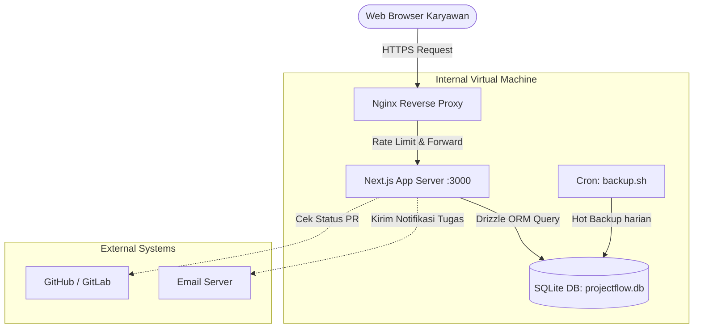
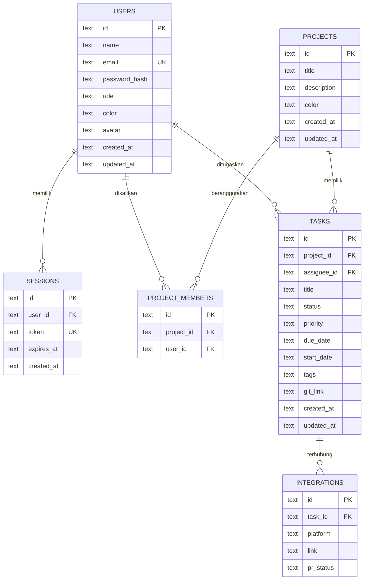

# ProjectFlow — System Architecture & Documentation

Dokumen ini merangkum keseluruhan arsitektur, teknologi, dan alur bisnis dari aplikasi **ProjectFlow** yang telah dikembangkan.

---

## 1. Tech Stack Overview

Aplikasi ini dibangun menggunakan arsitektur modern berkinerja tinggi, dioptimalkan untuk _deployment_ pada skala internal perusahaan (Virtual Machine / On-Premise).

**Frontend:**
- **Framework:** Next.js 16.1 (App Router)
- **Styling:** Tailwind CSS v4, Vanilla CSS (tema QraftHive)
- **Komponen UI:** shadcn/ui (Radix Primitives)
- **Fungsionalitas Khusus:** `@hello-pangea/dnd` (Drag-and-Drop Kanban), `lucide-react` (Ikon)
- **Font:** Outfit (Sans-serif), JetBrains Mono (Monospace)

**Backend:**
- **Runtime:** Node.js (via Next.js API Routes)
- **Database:** SQLite (`better-sqlite3`) — Sangat ringan dan cepat untuk skala <50 user.
- **ORM:** Drizzle ORM — _Type-safe_ database interaction.
- **Autentikasi:** Custom Session Authentication (HTTP-Only Sessions)
- **Integrasi (Disiapkan):** GitHub/GitLab API, SMTP Email Notification, iCal (.ics) Sync Export.

**Deployment & Infrastructure:**
- **Containerization:** Docker (Multi-stage build) & Docker Compose
- **Reverse Proxy:** Nginx (Rate Limiting, Security Headers)
- **Backup:** Custom Bash Script via _Cron Job_ (Hot backup SQLite dengan Gzip 30-hari).

---

## 2. Fitur Utama & Business Flow

ProjectFlow adalah sistem manajemen proyek yang meniru Trello/Linear, namun menjaga privasi penuh karena data disimpan di peladen lokal.

### A. Alur Pengguna (User Journey)
1. **Masuk (Login/Register):** 
   - Karyawan baru bisa mendaftarkan email melalui `/register`.
   - Atau masuk menggunakan kredensial yang valid di `/login`. 
   - Aksi ini menciptakan sesi otentikasi (cookie berumur 7 hari).
2. **Dashboard Overview (`/`):**
   - Karyawan disambut dengan panel ringkasan: jumlah tugas aktif, progres proyek, metrik tim, dan tugas spesifik miliknya.
3. **Manajemen Proyek (`/projects`):**
   - Manajer dapat membuat proyek baru, menetapkan warna label, dan mengelola (*edit/delete*) proyek aktif.
4. **Kanban & Tugas (`/board/[projectId]`):**
   - Anggota tim membuka proyek untuk memanajemen tugas harian di papan Kanban.
   - Papan dibagi menjadi kolom: *To Do, In Progress, Review,* dan *Done*.
   - Pembaruan progres dilakukan cukup dengan menggeser (*drag-and-drop*) kartu tugas antar kolom.
5. **Timeline View:**
   - Menyediakan tampilan *Gantt Chart* bagi manajer untuk memonitor silang rentang tugas (*Start Date* & *Due Date*) guna mencegah *bottleneck* tenggat waktu.

---

## 3. Technology Flow & Arsitektur Sistem

Aplikasi ini menggunakan topologi _Monolith_ modern di mana Frontend dan Backend bersatu dalam wadah Next.js.

### A. Diagram Interaksi

### B. Alur Autentikasi (Middleware Protection)
1. Pengguna mengetik kredensial di form login.
2. Web memanggil `POST /api/auth`, mencocokkan hash password vs database.
3. Jika cocok, sistem me-generate `128-bit Session ID` ke tabel `sessions` dan menyematkannya di *Cookie browser* (metode teraman melawan serangan XSS).
4. Setiap rute diproteksi oleh `middleware.ts` — jika tidak ada cookie autentikasi yang valid, akan di *redirect* kembali ke `/login`. Permintaan dari API akan ditolak menjadi `401 Unauthorized`.

---

## 4. Skema Database (Entity-Relationship)

Skema database sangat efisien, terdiri dari 6 tabel utama:

### Tabel Relasional:
- **`projects`**: Melacak area kerja tim utama.
- **`tasks`**: Mewakili tiket/kertas kerja individu. *Enums* status: `todo`, `in-progress`, `review`, `done`.
- **`users`**: Para pegawai internal.
- **`project_members`**: Tabel perantara (*many-to-many*) antara proyek dan anggota tim.
- **`integrations`**: Mencatat tautan *Pull Request* dan API ke git service untuk setiap task (jika ada).
- **`sessions`**: Manajemen otentikasi login secara aman.

---

## 5. Deployment Setup

Produk siap diisolasi dan dijalankan menggunakan `Docker`.
1. **`npm run build`**: Next.js me-_compile_ aplikasi menuju konfigurasi keluaran _Standalone_ yang super kecil.
2. **`docker-compose up -d`**:
   - Memasukkan aplikasi Node.js ke kontainer internal (`projectflow-app`).
   - Menyambungkan Nginx (`projectflow-nginx`) di gerbang depan untuk meng-handle trafik masuk.
   - Folder database `/data` akan di *mount* keluar kontainer (sebagai *volume*) menjamin data **tidak ada yang hilang** meski kontainer direstart.
3. Skrip `scripts/backup.sh` berjalan harian mengompres (`.gz`) berkas `projectflow.db` sebagai pelindung bencana.

Aplikasi telah berhasil disiapkan sebagai perangkat tatap muka setara standar enterprise yang ringan dan kencang.
