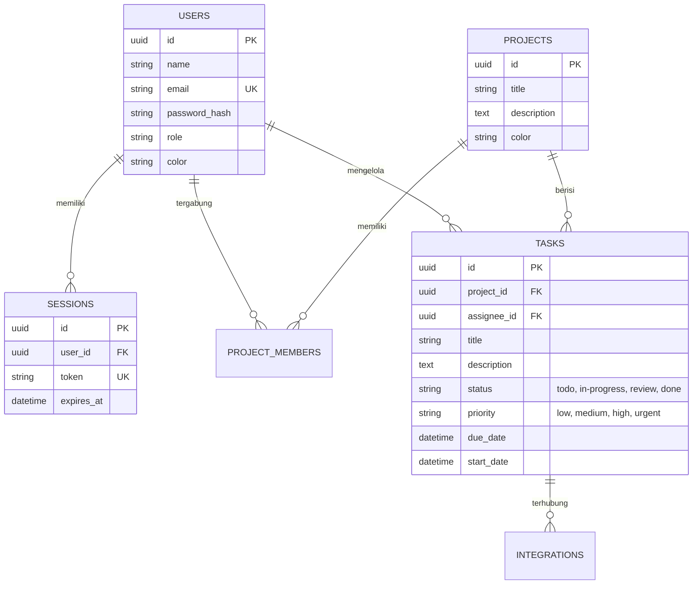

# Technical Requirements Document (TRD) — ProjectFlow

**Version:** 1.0.0  
**Role:** Senior System Architect & Lead Developer  
**Project:** ProjectFlow (Internal Project Management System)

---

## 1. Tech Stack & Dasar Pemilihan

Kombinasi teknologi berikut dipilih untuk memastikan performa tinggi, skalabilitas tim kecil, dan keamanan data internal.

*   **Frontend & Backend (Fullstack):** **Next.js 16 (App Router)**. Memberikan keunggulan *Server-Side Rendering* (SSR) untuk SEO internal dan *Static Site Generation* (SSG) untuk dashboard yang cepat. API Routes digunakan sebagai backend terpadu.
*   **Styling:** **Tailwind CSS 4** & **Shadcn UI**. Memungkinkan pembuatan UI yang konsisten dan premium dengan kecepatan pengembangan yang sangat tinggi.
*   **Database:** **PostgreSQL**. Pilihan standar industri untuk data relasional, mendukung query kompleks dan integritas data yang kuat dibandingkan SQLite untuk kebutuhan jangka panjang.
*   **ORM:** **Prisma ORM**. Menyediakan *type-safety* end-to-end yang memudahkan developer dalam memanipulasi data tanpa error manual pada query SQL.
*   **Cloud/Hosting:** **Docker & Nginx**. Aplikasi dikemas dalam kontainer untuk konsistensi lingkungan *deployment*. Nginx bertindak sebagai *reverse proxy* untuk menangani SSL, sinkronisasi statis, dan keamanan tingkat lanjut.

---

## 2. UI/UX Specification

Fokus utama adalah **kecepatan (Speed)** dan **kerapian (Clarity)**.

*   **3-Layer Layout:** Sidebar persisten (navigasi), Top Bar (pencarian & profil), dan Workspace (area kerja utama).
*   **Keyboard-First:** Dukungan *Command Palette* (CMD+K) untuk pembuatan tugas atau navigasi cepat tanpa mouse.
*   **Kontekstual:** Task Detail muncul sebagai *slide-over panel* agar pengguna tidak kehilangan konteks saat bekerja di papan Kanban.
*   **Micro-interactions:** Animasi halus pada transisi status tugas (*drag-and-drop*) dan *loading states* skeleton untuk memberikan feedback instan.

---

## 3. Fitur Utama & Business Flow

### Skenario Bisnis (Happy Path):
1.  **Onboarding:** Pengguna login/register dan diarahkan ke Dashboard.
2.  **Creation:** Manajer membuat Proyek baru dan menambahkan anggota tim.
3.  **Execution:** Tim membuat Tugas (Tasks) di dalam proyek, menentukan prioritas, dan menugaskannya ke anggota tim.
4.  **Collaboration:** Status tugas diperbarui via Kanban (Drag-and-Drop). Diskusi dilakukan di kolom komentar tugas.
5.  **Monitoring:** Manajer memantau beban kerja (Workload) dan rentang waktu (Timeline) untuk memastikan tidak ada keterlambatan.

---

## 4. Arsitektur Sistem & Technology Flow

*   **Data Flow:** Client mengirimkan request (JSON) via Fetch API ke Next.js API Routes. Backend memproses logika bisnis, berinteraksi dengan PostgreSQL via Prisma, dan mengembalikan response terstruktur.
*   **Authentication & Middleware:**
    *   **Metode:** Session-based authentication menggunakan cookie `HttpOnly` untuk mencegah serangan XSS.
    *   **Middleware:** `middleware.ts` mengecek validitas session pada setiap request rute sensitif (`/dashboard`, `/api/*`).
    *   **Role-Based Access Control (RBAC):** Middleware memverifikasi peran pengguna (`admin`, `member`, `viewer`) sebelum mengizinkan mutasi data.
*   **Error Handling:** Global Error Boundary di sisi frontend dan Try-Catch block di backend dengan standarisasi response error (e.g., `{ error: "Message", code: 400 }`).

---

## 5. Skema Database (Relational Schema)



*   **Indeks Strategis:** `IDX_tasks_project_id` dan `IDX_tasks_assignee_id` untuk mempercepat filtering tugas di Dashboard dan Kanban.

---

## 6. Komponen Tambahan yang Wajib Ada

### API Contract (Example: Create Task)
*   **Endpoint:** `POST /api/tasks`
*   **Request Body:**
    ```json
    {
      "projectId": "uuid",
      "title": "Build API",
      "priority": "high",
      "assigneeId": "uuid"
    }
    ```
*   **Response (201 Created):**
    ```json
    { "id": "uuid", "status": "success" }
    ```

### Security Strategy
*   **SQL Injection:** Dicegah secara otomatis oleh Prisma ORM melalui parameterized queries.
*   **XSS Protection:** Enkoding otomatis oleh React/Next.js serta penggunaan cookie `HttpOnly` & `SameSite: Strict`.
*   **Rate Limiting:** Dikonfigurasi di level Nginx (e.g., 60 requests per minute per IP) untuk mencegah Brute Force.

### State Management
*   **Server State:** Menggunakan **React Query** (TanStack Query) untuk caching data API dan sinkronisasi status real-time.
*   **UI State:** Menggunakan **Zustand** untuk mengelola state global yang ringan seperti sidebar toggle atau filter aktif.

### Testing Strategy
*   **Unit Test (Wajib):** Logika kalkulasi progres, utility pemformatan tanggal, dan helper autentikasi.
*   **Integration Test (Wajib):** Alur pembuatan tugas (POST API) dan proteksi Middleware (Auth guard).

---

> [!WARNING]
> **Bottleneck Alert:** Pada skala 1000+ tugas dalam satu board, render Kanban dapat melambat. Disarankan menggunakan *Windowing/Virtualization* untuk daftar tugas yang panjang.
