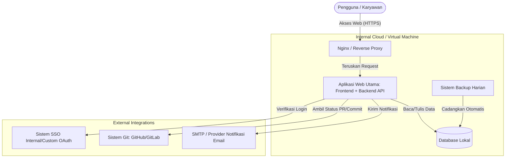
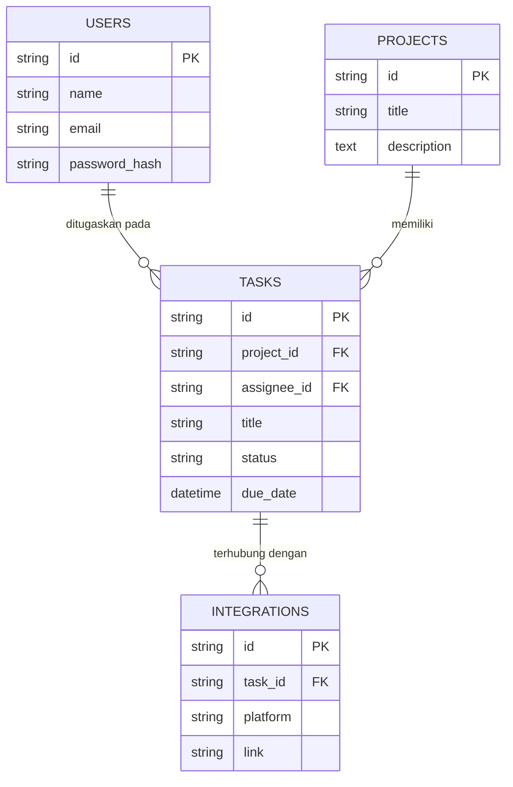

# PRD — Project Requirements Document

## 1. Overview
Aplikasi ini adalah sistem manajemen proyek kolaboratif berbasis web (mirip Trello) yang dirancang secara khusus untuk di-hosting di jaringan internal *cloud* (On-Premise/Internal VM). Aplikasi ini bertujuan untuk membantu tim kecil (kurang dari 50 pengguna) dalam merencanakan, memonitor, dan menyelesaikan tugas sehari-hari tanpa harus bergantung pada layanan pihak ketiga. Dengan menyimpan data di peladen (server) internal, perusahaan memiliki kontrol penuh atas keamanan dan privasi data mereka, sekaligus mendapatkan fitur modern seperti tampilan Kanban, lini masa (Timeline), integrasi Git, dan laporan analitik.

## 2. Requirements
- **Kapasitas Pengguna:** Sistem harus dioptimalkan untuk berjalan sangat cepat dan ringan untuk skala tim kecil (di bawah 50 pengguna aktif).
- **Keamanan & Akses:** Harus memiliki sistem *login* menggunakan Email/Password standar dan mendukung *Custom OAuth* (bisa diintegrasikan dengan sistem SSO internal perusahaan).
- **Infrastruktur & Deployment:** Dirancang untuk mudah di-deploy ke dalam satu Virtual Machine (VM) internal perusahaan.
- **Keandalan Data:** Wajib memiliki fitur pencadangan (backup) data base otomatis setiap hari untuk mencegah kehilangan data.
- **UI/UX:** Antarmuka harus bersih, modern, dan seintuitif mungkin dengan dukungan *drag-and-drop* yang mulus.

## 3. Core Features
Fitur-fitur utama yang akan dikembangkan dalam aplikasi ini:
- **Manajemen Visual (Kanban & Timeline):** Papan *Kanban* dengan fitur geser-dan-letak (drag-and-drop) untuk memindahkan tugas antar status (misal: *To Do, In Progress, Done*). Tersedia juga tampilan *Timeline* (Gantt Chart) untuk melihat rentang waktu proyek.
- **Manajemen Tugas & Kolaborasi:** Kemampuan untuk membuat tugas, menambahkan deskripsi, tenggat waktu, dan menugaskan tugas (*Assign Task*) kepada anggota tim spesifik.
- **Laporan Dashboard:** Halaman ringkasan yang menampilkan metrik proyek, daftar tugas yang tertunda, beban kerja anggota tim, dan progres proyek.
- **Sistem Notifikasi:** Pengiriman email otomatis untuk mengingatkan pengguna tentang tugas baru, tugas yang mendekati tenggat waktu, atau pembaruan penting.
- **Integrasi Eksternal:** 
  - *Calendar Sync:* Sinkronisasi tenggat waktu tugas ke kalender eksternal (Google Calendar, Outlook, Apple Calendar) via tautan iCal.
  - *Git Integration:* Menghubungkan tugas dengan repositori (GitHub/GitLab internal) sehingga status tugas dapat diperbarui jika ada status *Pull Request* atau *Commit*.

## 4. User Flow
Berikut adalah perjalanan sederhana yang dilakukan pengguna saat menggunakan aplikasi:
1. **Login:** Pengguna masuk menggunakan kredensial perusahaan (OAuth) atau Email/Password standar.
2. **Lihat Dashboard:** Setelah masuk, pengguna disambut oleh *Dashboard* yang merangkum tugas mereka hari itu dan status proyek yang sedang berjalan.
3. **Pilih Proyek:** Pengguna mengklik salah satu proyek dan otomatis masuk ke tampilan *Kanban Board*.
4. **Kelola Tugas:** Pengguna menekan tombol "Tambah Tugas", mengisi detail, mengatur tenggat waktu, dan menugaskannya ke rekan kerja. Rekan kerja akan langsung menerima Notifikasi Email.
5. **Perbarui Status:** Pengguna menggeser kartu tugas dari kolom "To Do" ke "In Progress". Jika terintegrasi dengan Git, tautan *commit* dapat disematkan di dalam kartu tugas.
6. **Pantau Timeline:** Manajer beralih ke *Timeline View* untuk melihat apakah tenggat waktu tugas tersebut bentrok dengan tugas lainnya.

## 5. Architecture
Aplikasi ini akan menggunakan arsitektur monolitik modern yang sangat efisien untuk di-deploy pada Virtual Machine. Aplikasi web (*Frontend* dan *Backend*) dikemas menjadi satu kesatuan dan berkomunikasi langsung dengan database lokal di VM tersebut.

## 6. Database Schema
Karena skala pengguna berada di bawah 50 orang, skema database dirancang sederhana namun relasional untuk mencakup semua fitur.

**Daftar Tabel Utama:**
- **Users**: Menyimpan data anggota tim.
  - `id` (String/UUID): ID unik pengguna.
  - `name` (String): Nama lengkap pengguna.
  - `email` (String): Alamat email untuk login dan notifikasi.
  - `password_hash` (String): Kata sandi terenkripsi (opsional jika via OAuth).
- **Projects**: Area kerja atau papan manajemen.
  - `id` (String/UUID): ID unik proyek.
  - `title` (String): Nama proyek.
  - `description` (Text): Penjelasan singkat tentang proyek.
- **Tasks**: Tiket/Tugas satuan.
  - `id` (String/UUID): ID unik tugas.
  - `project_id` (Relasi): Merujuk pada ID dari tabel Projects.
  - `assignee_id` (Relasi): Merujuk pada ID dari tabel Users.
  - `title` (String): Judul tugas.
  - `status` (String): Status progres (contoh: "To Do", "In Progress").
  - `due_date` (DateTime): Tenggat waktu penugasan.
- **Integrations**: Menyimpan token atau status integrasi (Git/Calendar).
  - `id` (String/UUID): ID unik.
  - `task_id` (Relasi): Tugas terkait.
  - `platform` (String): Nama layanan (GitLab, GitHub).
  - `link` (String): Tautan URL terkait.

## 7. Tech Stack
Untuk memenuhi kebutuhan sistem berkinerja tinggi, modern, ringan, dan mudah di-hosting sendiri pada internal VM, berikut adalah rekomendasi teknologinya:

- **Frontend & Backend (Fullstack Framework):** **Next.js** (App Router). Kerangka kerja ini memungkinkan kita membangun UI yang interaktif sekaligus menangani API server dan proses keamanan autentikasi dalam satu basis kode utama.
- **Styling & UI Components:** **Tailwind CSS** dipadukan dengan **shadcn/ui** untuk menghasilkan desain antarmuka yang setara dengan Trello, profesional, minimalis, dan mendukung fitur *drag-and-drop* dengan performa mulus.
- **Database:** **SQLite**. Karena target adalah organisasi internal dengan kurang dari 50 pengguna, SQLite adalah pilihan *serverless database* di level file yang sangat luar biasa cepat, andal, dan sangat mudah untuk dilakukan *backup* harian di Virtual Machine (*cukup menyalin filenya secara otomatis*).
- **ORM (Object Relational Mapping):** **Drizzle ORM**. Alat penghubung database yang sangat ringan dan modern, berjalan sangat cocok dengan Next.js dan SQLite.
- **Autentikasi:** **Better Auth**. Library autentikasi modern yang sangat pas dengan ekosistem Next.js, mendukung pembuatan format masuk menggunakan Email/Password sekaligus Custom OAuth internal tanpa konfigurasi yang memusingkan.
- **Deployment & Backup:** Dikelola menggunakan **Docker** (Docker Compose) agar mudah dijalankan di Virtual Machine, dengan bantuan *Cron Job* sistem operasi untuk menduplikasi file database SQLite secara otomatis ke ruang penyimpanan lain secara harian as *backup*.